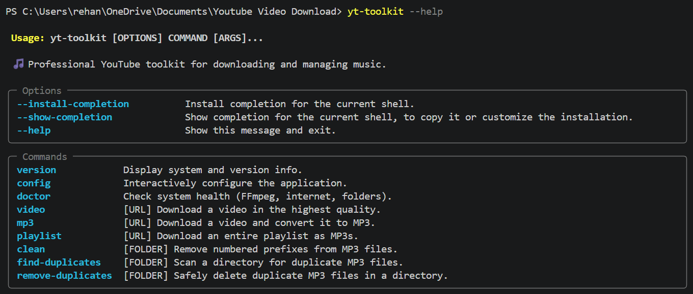
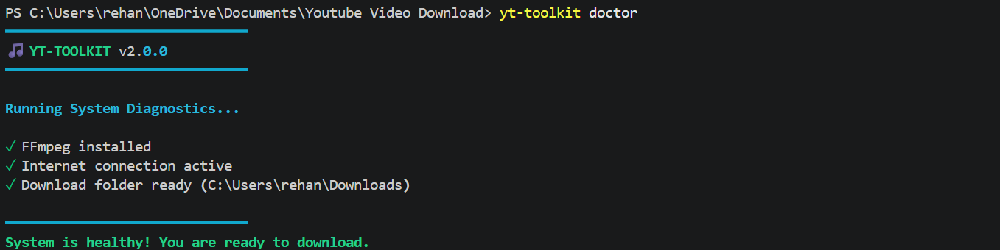
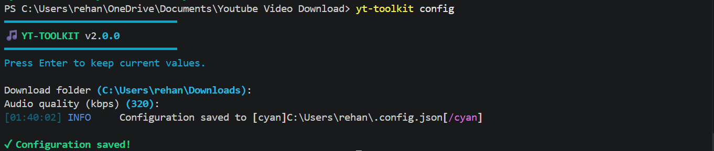
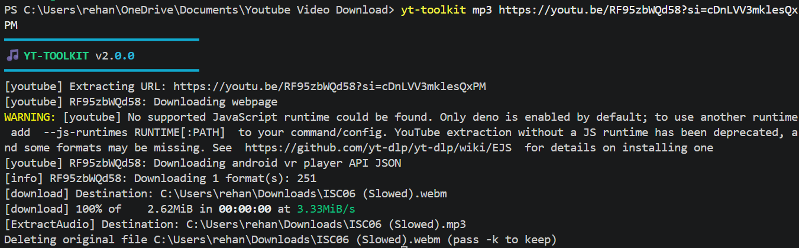

# 🎵 YouTube Toolkit (`yt-toolkit`)

**A professional, high-performance CLI for downloading, extracting, and managing YouTube music libraries.**

[](https://python.org)
[](https://github.com/yt-dlp/yt-dlp)
[](https://typer.tiangolo.com/)
[](https://rich.readthedocs.io/)
[](https://opensource.org/licenses/MIT)

**[📖 Philosophy](#-the-philosophy)** | **[⚡ Features](#-deep-dive-features)** | **[🚀 Installation](#-comprehensive-installation)** | **[💻 Usage Guide](#-advanced-usage-guide)** | **[🚑 Troubleshooting](#-troubleshooting--faq)** | **[🏗️ Architecture](#-project-architecture)** | **[🤝 Contributing](#-contributing)**

## ✨ Features

• CLI Commands: **8+**  
• Modules: **8**  
• Tests: **10+**  
• Python: **3.8+**  
• License: **MIT**

---

## ⚡ Quick Start

```bash
pip install -e .
yt-toolkit doctor
yt-toolkit mp3 "URL"
yt-toolkit playlist "URL"
```

---

## 📖 The Philosophy

There are hundreds of YouTube downloader scripts on GitHub, but most suffer from the same issues: they lack robust error handling, feature messy and unintuitive user interfaces, or leave your local file system cluttered with duplicate files and poorly named tracks.

> **`yt-toolkit` was engineered to be different.** It bridges the gap between a simple Python script and a production-grade software application. By wrapping the immense power of `yt-dlp` in a beautiful, type-safe command-line interface built with `Typer` and `Rich`, this toolkit not only downloads your media reliably but actively helps you maintain and organize your offline music library.

Whether you are downloading a single 4K video, backing up a massive 500-song playlist, or trying to clean up gigabytes of duplicated MP3s, `yt-toolkit` handles it with professional precision.

---

## ⚡ Deep Dive Features

### 🎧 1. Next-Generation Extraction Engine

* **Format Optimization:** Automatically queries YouTube's servers to target the absolute highest available audio bitrates and video resolutions.
* **FFmpeg Integration:** Uses raw FFmpeg post-processing to losslessly extract audio streams into perfectly formatted MP3 files, bypassing standard compression artifacts.
* **Android Client Spoofing:** Utilizes modern `yt-dlp` extractor arguments to spoof Android API requests, successfully bypassing recent YouTube web-player blocks and HTTP 403 errors on music mixes.

### 🧠 2. Cryptographic Library Management

* **SHA-256 Deduplication:** Traditional duplicate finders look at file names or sizes. `yt-toolkit` reads files in 1MB chunks and computes cryptographic SHA-256 hashes of the actual audio bytes. It will find duplicates even if one file is named `Song.mp3` and the other is `Track_01_final.mp3`.
* **Non-Destructive Scanning:** Preview exactly which files are duplicated before taking any destructive action using the `find-duplicates` command.
* **Safe Deletion:** The `remove-duplicates` command intelligently preserves one unique original file while sweeping away all redundant copies, saving gigabytes of disk space.

### 🧹 3. Automated File Sanitization

* **RegEx Filename Cleaning:** Downloading playlists often results in annoying prefixes (e.g., `01 - `, `02-`, `104 `). The built-in cleaner utilizes Regular Expressions to target and strip these numbers, leaving you with perfectly clean track titles.

### 🎨 4. Beautiful Developer Experience (DX)

* **Typer UI:** Shell autocompletion, beautifully formatted help menus, and strict type-hinting.
* **Rich Console:** Color-coded terminal outputs, dynamic tables, and visually distinct warning/error logs that make it clear exactly what the application is doing at all times.
* **System Diagnostics:** A built-in `doctor` command acts as an automated health check, verifying system PATH variables, internet connectivity, and folder write-permissions *before* you run into confusing runtime errors.

---

## 📸 Visual Showcase

### The Help Menu

*A clean, self-documenting interface powered by Typer. Discover commands instantly.*




### System Diagnostics (`doctor`)

*Never wonder why a download failed again. The doctor command checks your environment.*




### Interactive Configuration (`config`)

*Set your preferred download paths and bitrates. Preferences are saved persistently.*




### Real-time Downloading

*Clean extraction logs, FFmpeg processing statuses, and rich layout styling.*




---

## 🚀 Comprehensive Installation

### Phase 1: Prerequisites

To use `yt-toolkit` to its full potential, you must install the following core dependencies on your system:

#### 1. Python (3.8 or higher)

Ensure you have a modern version of Python installed.

* Check your version: `python --version`

#### 2. FFmpeg (Crucial for Audio Extraction)

`yt-dlp` requires FFmpeg to merge video/audio streams and convert files to MP3.

* **Windows:** Use [Scoop](https://scoop.sh/) (`scoop install ffmpeg`) or [Chocolatey](https://chocolatey.org/) (`choco install ffmpeg`).
* **macOS:** Use [Homebrew](https://brew.sh/) (`brew install ffmpeg`).
* **Linux (Debian/Ubuntu):** Run `sudo apt update && sudo apt install ffmpeg`.

#### 3. Node.js (Optional but Highly Recommended)

YouTube has recently implemented advanced anti-bot protections that require executing JavaScript challenges. Installing Node.js allows `yt-dlp` to solve these challenges natively in the background.

* Download from [NodeJS.org](https://nodejs.org/) or install via your package manager.

### Phase 2: Package Setup

Install the package locally in editable mode. This builds the CLI and registers the `yt-toolkit` command globally on your machine.

1. Clone the repository to your local machine:
```bash
git clone https://github.com/rsayyed591/youtube-toolkit.git
```
2. Navigate into the project directory:
```bash
cd youtube-toolkit
```
3. Install the package and dependencies:
```bash
pip install -e .
```
4. Verify the installation and system health:
```bash
yt-toolkit doctor
```

---

## 💻 Advanced Usage Guide

Once installed, `yt-toolkit` acts as a global command on your system. Here are detailed examples of how to utilize the suite.

### ⚙️ System & Configuration

**Check System Health:**
```bash
yt-toolkit doctor
```
*Use this if downloads are suddenly failing. It checks for FFmpeg presence, internet connection, and folder permissions.*

**Configure Preferences:**
```bash
yt-toolkit config
```
*Launches an interactive prompt. By default, downloads go to your user `Downloads` folder at `320kbps`. This command saves a persistent `config.json` file to your home directory so you never have to type paths again.*

**Check Versions:**
```bash
yt-toolkit version
```

### 📥 Downloading Media

**Download a Video (Best Quality):**
```bash
yt-toolkit video "https://youtube.com/watch?v=YOUR_ID"
```
*Downloads the highest quality video and audio streams separately, then uses FFmpeg to multiplex them into a single, seamless MP4 file.*

**Download Audio (MP3):**
```bash
yt-toolkit mp3 "https://youtube.com/watch?v=YOUR_ID"
```
*Downloads the best audio stream, processes it through FFmpeg, extracts a 320kbps MP3, and automatically deletes the original `.webm` or `.m4a` file.*

**Download an Entire Playlist:**
```bash
yt-toolkit playlist "https://youtube.com/playlist?list=YOUR_ID"
```
*Sequentially downloads every video in a playlist, extracts the audio, and saves them with numerical prefixes (e.g., `0001 - First Song.mp3`, `0002 - Second Song.mp3`) to preserve track order.*

### 🗄️ Library Management

**Sanitize Filenames:**
```bash
yt-toolkit clean "C:\Users\Name\Music\MyPlaylist"
```
*Removes all leading numbers and hyphens. `005 - Bohemian Rhapsody.mp3` becomes `Bohemian Rhapsody.mp3`.*

**Identify Duplicate Audio Files:**
```bash
yt-toolkit find-duplicates "C:\Users\Name\Music"
```
*Scans the provided directory, hashes every MP3 file, and prints a detailed report of any identical files found. This is a read-only command.*

**Eradicate Duplicate Audio Files:**
```bash
yt-toolkit remove-duplicates "C:\Users\Name\Music"
```
*Performs the cryptographic scan, keeps the first instance of a file, and permanently deletes all identical copies. Use with caution!*

---

## 🛠️ Configuration Architecture

When you run `yt-toolkit config`, the application generates a lightweight JSON file in your system's home directory (e.g., `~/.config.json` or `C:\Users\Name\.config.json`).

You can edit this file directly if preferred:
```json
{
"download_folder": "D:\Media\YouTube Music",
"quality": "320",
"cookies_path": ""
}
```
---

## 🚑 Troubleshooting & FAQ

**Q: I am getting `WARNING: [youtube] No supported JavaScript runtime could be found.**`

* **A:** YouTube is demanding a JS challenge to verify you aren't a bot. Install Node.js on your computer. `yt-dlp` will automatically detect it and solve the challenge silently.

**Q: My video downloaded as a `.webm` file instead of an `.mp4`!**

* **A:** This means `FFmpeg` is not installed or not added to your system's PATH. The toolkit needs FFmpeg to convert the raw `.webm` streams into `.mp4` or `.mp3`. Run `yt-toolkit doctor` to verify your FFmpeg installation.

**Q: I'm getting HTTP Error 403: Forbidden.**

* **A:** YouTube frequently updates its cipher algorithms. First, try updating the core dependency by running: `pip install --upgrade yt-dlp`.

**Q: Can I download Age-Restricted or Members-Only videos?**

* **A:** Yes, but you must provide authentication cookies. Export your YouTube cookies using a browser extension (like "Get cookies.txt LOCALLY"), save it as `cookies.txt`, and update the `cookies_path` in your `config.json`.

---

## 🏗️ Project Architecture

The project follows a modular design where each module has a single responsibility, making the codebase easier to maintain, test, and extend.

```text
youtube-toolkit/
│
├── yt_toolkit/
│   ├── cli.py            # Typer CLI entry points
│   ├── config.py         # Configuration management
│   ├── constants.py      # Global constants and version info
│   ├── doctor.py         # System diagnostics and dependency checks
│   ├── downloader.py     # yt-dlp wrapper and download logic
│   ├── duplicates.py     # Duplicate detection using SHA-256 hashing
│   ├── utils.py          # Rich console and logging utilities
│   └── cleaner.py        # Filename cleaning and formatting
│
├── tests/
│   ├── test_cleaner.py
│   ├── test_downloader.py
│   └── test_duplicates.py
│
├── screenshots/
├── .github/
│   └── workflows/
│       └── tests.yml
│
├── pyproject.toml
├── requirements.txt
└── README.md
```

### Module Responsibilities

| Module | Responsibility |
|---------|----------------|
| `cli.py` | Command-line interface using Typer |
| `config.py` | Configuration loading and storage |
| `constants.py` | Shared constants and version information |
| `doctor.py` | Environment validation and dependency checks |
| `downloader.py` | YouTube download logic using yt-dlp |
| `duplicates.py` | Duplicate file detection and removal |
| `utils.py` | Logging, Rich console, and helper utilities |
| `cleaner.py` | Filename sanitization and formatting |

---

## 🧪 Testing and CI

This project employs **Test-Driven Development (TDD)** using `pytest` to ensure that core logic (especially destructive logic like file deletion and file renaming) executes with 100% safety.

To prevent IP bans and slow test execution, the `yt-dlp` downloader is strictly mocked during the testing phase.

**Running the test suite locally:**

1. Install testing dependencies: `pip install pytest pytest-mock`
2. Run the test suite: `pytest tests/ -v`

**Continuous Integration:**
The project features a fully automated CI/CD pipeline via **GitHub Actions**. Every push and pull request to the `main` branch spins up an Ubuntu runner, configures Python 3.10, installs the package, and executes the entire Pytest suite. The repository badge reflects the live health of the `main` branch.

---

## 🗺️ Roadmap

Future features planned for upcoming releases:

- [ ] Spotify support
- [ ] GUI
- [ ] Async downloading

---

## 👨‍💻 Author

**Rehan Sayyed**

* **GitHub:** [@rsayyed591](https://github.com/rsayyed591)
* **Email:** [rehansayyed591@gmail.com](mailto:rehansayyed591@gmail.com)

---

## 🤝 Contributing

Contributions, bug reports, and feature requests are highly welcome! This project is open-source and thrives on community feedback.

1. Fork the Project
2. Create your Feature Branch: `git checkout -b feature/AmazingFeature`
3. Commit your Changes: `git commit -m 'feat: Add some AmazingFeature'`
4. Push to the Branch: `git push origin feature/AmazingFeature`
5. Open a Pull Request detailing your changes.

---

## 📄 License

This software is distributed under the **MIT License**. See the `LICENSE` file in the repository root for full legal information. You are free to modify, distribute, and use this code for personal or commercial projects.